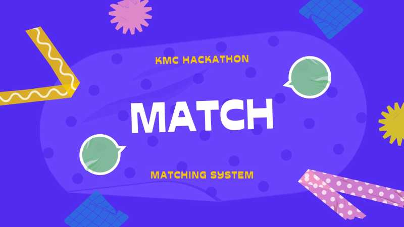
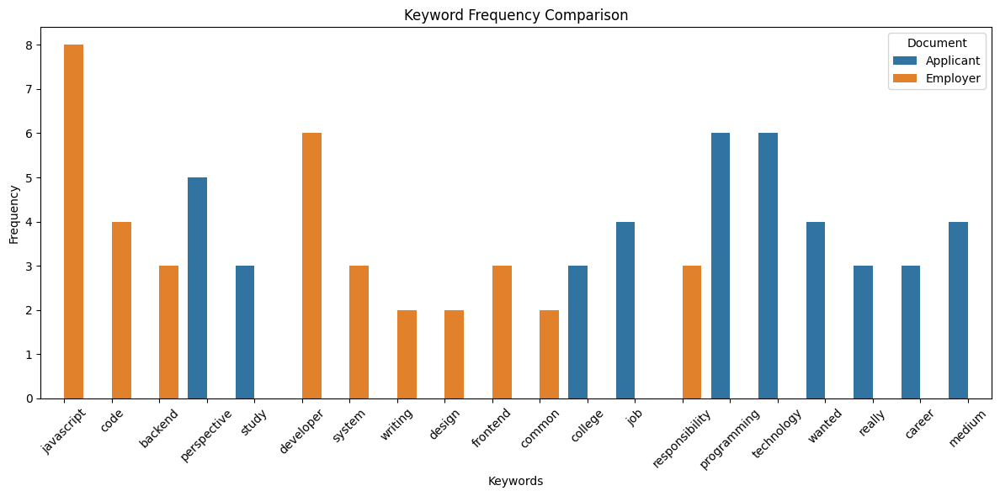
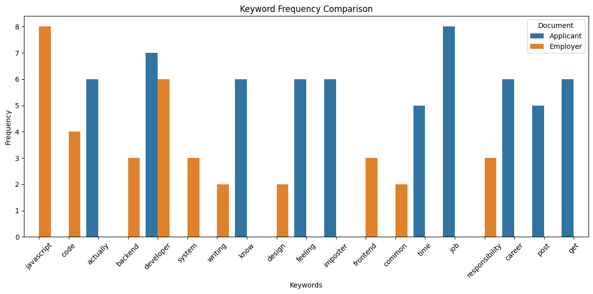

## Team Superphysics: Match for KMC Hackathon

- Juan Dalisay Jr.
- Michael Lituanias
- Jose Felizco

### Presentation: https://www.canva.com/design/DAGUcrWEWrs/fgHVrVhKiuM7qh1WsQyK8A/edit?utm_content=DAGUcrWEWrs&utm_campaign=designshare&utm_medium=link2&utm_source=sharebutton

### Google Colab: https://colab.research.google.com/drive/1X6jxnzczZOrNn3o4VhrCncOQIKC0UbMv?usp=sharing

This has parts

#### 1. Xamun UI at 
https://app.xamun.ai/walk-through-preview/663/1566

#### 2. Keras image recognition (match.py)

#### 3. Document Comparison (keyword.py)

Applicant 1: https://medium.com/@jojo_38618/a-personal-essay-on-my-journey-into-tech-518fcb8760d6

Applicant 2: https://zelig880.com/my-10-years-experience-as-a-javascript-software-engineer

> start time: 10am Oct 24, 2024

1. Import hands dataset from Kaggle and get only right hand palms  https://www.kaggle.com/datasets/shyambhu/hands-and-palm-images-dataset/code?resource=download

2. Create Python Script on Google Colab

- import modules
- data
  - upload data to collab  
  - assign to var
- dataset
  - create dataset params
  - split dataset to training 80% (train_ds) and validation 20% (val_ds)
  - find or set class names
  - pass the dataset to the Keras Model.fit method for training 
  - config dataset for performance
  - standardize the data in the dataset by normalizing
- model
  - create and compile the model
  - get summary
- train
- visualize results
- test on samples
  - criminal_palm.jpg
  - civilian_palm.jpg

> end time: Oct 25, 2022 (x hours)

### Problem/s Encountered

- Limited samples causes overfitting
- Palm images too varied

### Workaround

- Data augmentation -- generate additional training data from existing examples
- Manually select palm images that are proper
